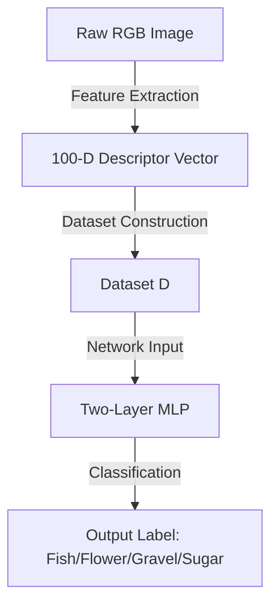

# Foundations of Neural Networks – Lectures

🎓 MIT Open Learning via 3MTT  

---

## Lecture 1: Neural Networks for Structured Data

**Taught by:** Professor Georgios Stamou, Professor at the School of Electrical and Computer Engineering at the National Technical University of Athens, Greece, and Visiting Professor at MIT.

### Lecture Overview
This lecture explores the foundations of neural network predictors on structured (tabular) data:
- **Building Quality Datasets**: Selecting features, sampling representative examples, and labeling correctly.
- **Defining Accuracy**: Measuring empirical error on training data and approximating true error with test data.
- **Training Perceptrons**: Iteratively adjusting weights to minimize mistakes.
- **Extending Capacity**: Combining perceptrons into multilayer networks to capture non-linear patterns.
- **Finding Balance**: Managing the trade-off between underfitting and overfitting, guided by the No Free Lunch theorem.
- **Improving Generalization**: Leveraging techniques like regularization, early stopping, and feature engineering.

### Learning Objectives
By the end of this lecture, learners will be able to:
- Define neural network predictors and explain their role in forecasting outcomes from structured (tabular) data.
- Describe the process of constructing high-quality datasets, including feature selection, sampling, and labeling.
- Explain the difference between empirical error, true error, and testing error in evaluating predictors.
- Interpret how perceptrons function as linear predictors and how multilayer perceptrons capture non-linear relationships.
- Analyze the trade-off between underfitting and overfitting when selecting neural network architectures.
- Identify regularization and model selection techniques that improve generalization in practice.

---

### Introduction to Predictors & Data Preparation

#### Predictors in Machine Learning
* **Definition**: Predictors are models designed to forecast unknown outcomes or estimate targeted variables ($y$) based on given input data ($x$).
* **Examples**: Assessing disease risk based on a patient's medical records or predicting if the weather will allow you to play tennis.
* **Why Neural Networks?**: Neural networks are widely used because of their flexibility and ability to capture complex, non-linear input-output relationships by interconnecting computational units called **neurons**.

#### Two-Phase Process of Neural Networks
1. **Training Phase**: The neural network learns the relationship between inputs and outputs using labeled training data. The parameters (known as **weights**) are iteratively adapted to minimize the prediction error.
2. **Prediction/Testing Phase**: The trained network with fixed parameters is used to estimate outcomes for new, unseen inputs.

---

### Data Collection & Tabular Data
This lecture focuses on **structured data**, specifically **tabular data** (rows of items/examples, columns of features).

* **Features**: Predictor variables that describe each item (e.g., outlook, temperature, humidity, wind). They can be numerical, categorical, or Boolean.
* **Labels**: The target outcome we want to predict (e.g., whether to play tennis, yes/no).
* **Dataset Representation ($D$)**: A dataset is represented as a set of vectors:
  $$D = \{(x_1, y_1), (x_2, y_2), \dots, (x_n, y_n)\}$$
  where $x$ represents the input feature vector and $y$ represents the target label.

---

### Three Core Tasks in Data Preparation

#### 1. Feature Selection
Selecting the appropriate features is critical. The chosen features must capture all relevant information. If we omit key features, the model will not be able to distinguish between different output labels.
* **Process**: Begin with domain understanding (expert interviews, literature study) to build a broad initial set of features. Once established, statistical methods and model diagnostics can be used to eliminate redundant or irrelevant variables.

#### 2. Sampling
Sampling involves selecting a representative subset of instances from the entire possible domain (denoted as capital $X$).
* **Domain Set ($X$)**: The set of all possible instances that can occur in the real world.
* **Likelihood of Occurrence ($d(x)$)**: The true probability distribution of an instance $x$ occurring.
* **Sampling Distribution ($p(x)$)**: The probability of an instance being selected for our dataset $D$. Ideally, $p(x)$ should equal the true occurrence rate $d(x)$ so that our sample is representative.
* **Dataset Size Rule of Thumb**:
  * For simpler models, dataset size should be at least **10 to 100 times the number of features**.
  * Alternatively, it should be at least **5 to 10 times the number of model parameters**.

#### 3. Labeling
Labeling is the process of associating each instance in our dataset with its correct target value (e.g., mapping weather features to a final "yes" or "no" decision).
* **Ideal Predictor ($f$)**: We assume the existence of an ideal predictor function $f(x) \rightarrow y$ that maps any instance from the domain set to its correct label with 100% accuracy.
* **Methodologies**:
  * **Automated**: Parsing database records of historical events (e.g., verifying if games were cancelled).
  * **Manual**: Hand-labeling by human experts (necessary for novel scenarios or instances with no historical records).

---

### Training and Evaluating Predictors

#### The Optimization Process
Finding a good neural network predictor involves adjusting the model's parameters (weights) to minimize its error on the training dataset. This is completed in two primary steps:
1. **Architecture Selection**: Determine the model architecture to use. This defines a hypothesis space $H$, which is a set of different possible neural networks where each network corresponds to a unique set of parameter weights.
2. **Parameter Optimization**: Select the best neural network $h \in H$ that minimizes the error.

#### Empirical Error
* **Definition**: The proportion of wrong predictions the neural network makes on the training dataset.
* **Mathematical Representation ($L_m$)**:
  $$L_m(h) = \frac{1}{|D|} \sum_{(x, y) \in D} \mathbb{I}(h(x) \neq y)$$
  where $\mathbb{I}$ is the indicator function (equals 1 if the prediction $h(x)$ is incorrect relative to the true label $y$, and 0 otherwise).
* **Target ($h_D$)**: The neural network within our hypothesis set $H$ that achieves the minimal empirical error on dataset $D$.

#### True Error
* **Definition**: The proportion of incorrect predictions the neural network makes across the entire domain set $X$ (not just within our sample dataset $D$).
* **Challenge**: We cannot directly calculate the true error because the domain set is huge or infinite, and we do not know the true labels for all instances in $X$.

#### Testing Error (Approximation of True Error)
To estimate how well our chosen model $h_D$ generalizes to unseen data, we approximate the true error using the **testing error**.
* **Train/Test Split**: We randomly partition our initial dataset $D$ into two disjoint parts:
  * **Training Set (typically 70%)**: Used to adjust the parameters/weights of the neural network during training.
  * **Testing Set (typically 30%)**: Kept completely hidden during training. It is reserved solely for evaluating the model's performance before deployment.

#### The Core Generalization Question
Does the model $h_D$ that minimizes empirical error on the training set necessarily minimize the true error across the entire domain? 
Understanding the relationship between empirical error and true error requires analyzing the network's architecture, its capacity, and the generalization techniques applied during training.

---

### Key Challenges in Neural Network Predictors

1. **Input Representation**: Defining a high-quality, representative set of features.
2. **Sampling**: Designing an effective sampling strategy to build a dataset $D$ that accurately reflects the domain $X$.
3. **Labeling**: Correctly assigning targets for all training items.
4. **Architecture Selection**: Selecting the optimal neural network architecture (determining capacity).
5. **Training**: Minimizing empirical error on the dataset.
6. **Inference Evaluation**: Minimizing true error to ensure resilient generalization on unseen data.

---

## Perceptrons and Linear Separation

The **perceptron** is the first and most fundamental neural network predictor, serving as the core building block for even the most complex deep learning architectures.

### Numerical Representation & Feature Projection
To build a perceptron, continuous/numerical representations of features are used instead of categorical ones:
* **Numerical Outlook**: Represented as a continuous variable where $0 \le x < 1$ indicates degrees of cloud cover in dry conditions, and $1 \le x \le 2$ indicates rain intensity (from light rain to storms).
* **Temperature**: Represented in degrees Celsius ($^{\circ}\text{C}$).
* **Windy**: Wind intensity represented as a continuous variable between $0$ and $1$.

#### Feature Projections (2D Planes)
To gain intuitive insights, high-dimensional datasets are often projected onto two features at a time (e.g., temperature vs. wind). While this results in a loss of information, it allows us to plot data points on a two-dimensional Cartesian coordinate plane to visualize classification boundaries.

### Linear Separators
A **linear separator** is a straight line (in 2D space) or a hyperplane (in higher dimensions) that splits data points into two distinct classes.
* **Equation of the Separator**: A straight line is mathematically represented as:
  $$w_1 X_1 + w_2 X_2 - b = 0$$
  where $X_1$ and $X_2$ are the input features, $w_1$ and $w_2$ are their respective **weights**, and $b$ is the **threshold** (or negative bias).
* **Classification Rule**:
  * If $w_1 X_1 + w_2 X_2 - b > 0$, the activation is positive (sign $= +1$), classifying the instance into the first class (e.g., *Play Tennis = No*).
  * If $w_1 X_1 + w_2 X_2 - b < 0$, the activation is negative (sign $= -1$), classifying the instance into the second class (e.g., *Play Tennis = Yes*).

---

### Perceptron Architecture and Inference

A perceptron consists of:
1. **Inputs ($X_1, X_2, \dots, X_K$)**: The $K$ features of the instance.
2. **Weights ($w_1, w_2, \dots, w_K$)**: Parameters corresponding to the importance of each feature.
3. **Threshold ($b$)**: The cutoff value for making a decision.
4. **Activation ($U$)**: The combined input signal:
   $$U = \sum_{i=1}^K w_i X_i - b$$
5. **Activation Function**: The simplest is the **sign function** ($sign(U)$), which maps the continuous activation to discrete classes ($+1$ or $-1$). Modern neural networks use smoother alternatives like **Sigmoid** or **ReLU (Rectified Linear Unit)**.

#### Inference Example
Consider a tennis predictor with two features: $X_1$ (temperature) and $X_2$ (wind intensity), weights $w_1 = 1, w_2 = 35$, and threshold $b = 35$.
For a new weather condition with features $X_1 = 20, X_2 = 0.2$:
1. Calculate the activation $U$:
   $$U = (1 \times 20) + (35 \times 0.2) - 35 = 20 + 7 - 35 = -8$$
2. Determine the sign:
   $$sign(U) = sign(-8) = -1$$
3. Since the sign is negative, the output prediction is **Yes** (Play Tennis = Yes).

---

### Biological Inspiration

The structure of a perceptron is modeled as a simplified biological neuron:
* **Dendrites**: Receive incoming electrochemical signals $\rightarrow$ Corresponds to **Inputs ($X_i$)**.
* **Synaptic Terminals**: Adjust connection strengths to control signal transmission $\rightarrow$ Corresponds to **Weights ($w_i$)**.
* **Cell Body (Soma)**: Integrates and processes incoming signals $\rightarrow$ Corresponds to the **Activation Center (Summation + Activation Function)**.
* **Axon**: Transmits the resulting output signal to other neurons $\rightarrow$ Corresponds to the final **Output ($Y$)**.

---

### Perceptron Learning & Batch Training Algorithm

Training a perceptron means finding parameters ($w_i$, $b$) that minimize the **empirical error** (the proportion of misclassified training points).

#### Batch Perceptron Training Algorithm
Batch training is an iterative algorithm that automatically learns these parameters from a dataset:
1. **Initialization**: Start with randomly initialized weights and thresholds.
2. **Epochs**: Present all items in the dataset repeatedly over multiple cycles (epochs).
3. **Parameter Update Rule**: For each item in the dataset:
   * If the prediction is **correct**, do nothing.
   * If the prediction is **incorrect** (a mistake occurs), update the parameters:
     $$w_i^{\text{new}} = w_i^{\text{old}} + \beta \times \text{loss} \times X_i$$
     where:
     * $\beta$ is the **learning rate** (a small positive number, e.g. 0.01, controlling the step size of each adjustment).
     * $\text{loss}$ is the prediction error (determining direction).
     * $X_i$ is the input value associated with weight $w_i$.

#### Core Learning Concepts
* **Credit Assignment**: Weights are modified proportionally to their corresponding input $X_i$, meaning parameters are adjusted based on their actual contribution to the overall error.
* **Error Reduction**: The sign of the update moves the weights in a direction that reduces the probability of repeating the same error in future epochs.

#### Convergence & Limitations
* **Batch Convergence Theorem**: If the classes in the dataset are linearly separable, the batch perceptron training algorithm is guaranteed to converge and find a perceptron with a minimal (zero) empirical error.
* **Linear Constraint**: A perceptron is strictly a **linear classifier**. It cannot solve non-linearly separable problems (like the XOR function).

---

## Multi-Layer Perceptrons (MLPs)

### Limitations of Single Perceptrons
A single perceptron creates a single linear boundary. In many real-world scenarios, a single linear boundary is insufficient because features interact:
* **The Tennis Example (2-Feature Projection)**:
  * **Blue Perceptron**: Captures the temperature threshold (high temperatures $\rightarrow$ No play) but ignores wind speed, misclassifying windy days.
  * **Magenta Perceptron**: Captures the wind speed threshold (strong winds $\rightarrow$ No play) but ignores temperature, misclassifying hot days.
* **Underfitting**: This inability of linear models to capture complex multi-feature interactions or non-linear decision boundaries is known as **underfitting**.

---

### Combining Perceptrons: The Logical Conjunction
To bypass this limitation, we can combine the predictions of multiple individual perceptrons.
* **Logical AND (Conjunction)**: We define a new classification rule where we play tennis only if the day is below *both* the blue line *and* the magenta line.
* **Technical Implementation**:
  * We use a third, "combining" perceptron (green perceptron) that implements a logical **AND** gate.
  * This combining perceptron takes the outputs of the first two perceptrons as inputs. Its weights are set such that it outputs $-1$ (Yes) only when both inputs are $-1$. Otherwise, it outputs $+1$ (No).

---

### Two-Layer Perceptron Architecture
Interconnecting perceptrons in this manner creates a **two-layer perceptron** (also known as a Multi-Layer Perceptron or MLP with one hidden layer):

1. **Input Layer**: Receives the raw features (e.g., $X_1$: temperature, $X_2$: wind speed).
2. **Hidden Layer**: Consists of two hidden neurons (the blue and magenta perceptrons), each computing a linear boundary:
   * $h_1(x) = sign(w_{11} X_1 + w_{12} X_2 - b_1)$
   * $h_2(x) = sign(w_{21} X_1 + w_{22} X_2 - b_2)$
3. **Output Layer**: A single output neuron (the green perceptron) that combines the hidden layer representations:
   * $Y = sign(w_{o1} h_1(x) + w_{o2} h_2(x) - b_o)$

#### Performance & Intuition
* **Decision Boundary**: The resulting boundary is non-linear (an intersection of two half-spaces, forming a wedge).
* **Empirical Error**: The empirical error drops to $0.07$ (93% accuracy on the 14-item training set), misclassifying only one noisy/insufficiently described point.
* **Intuition**: This model correctly reflects that both high temperature and strong wind prevent playing tennis. We expect it to generalize well (achieving a small true error).

---

### Capacity vs. Generalization: The Overfitting Dilemma

What if we increase model capacity further to achieve $0$ empirical error?

#### 5-Neuron Hidden Layer MLP ($h'$)
* **Architecture**: A two-layer perceptron with 5 neurons in the hidden layer, which combines 5 different linear boundaries.
* **Empirical Error**: Hits exactly $0$ on the training set (a "perfect" score).
* **Boundary Complexity**: The decision boundary becomes highly convoluted, wrapping around specific data points (e.g. creating a narrow corridor that labels mild temperature + weak wind as "No play").
* **Generalization Failure (Overfitting)**:
  * This model is overly complex and captures noise or anomalies in the dataset rather than general rules.
  * For example, it misclassifies a day $x$ with ideal tennis weather (mild temp, weak wind) as "No play".
  * In reality, that specific misclassified training point was due to *unobserved features* (like extremely high humidity or rain outlook) not included in the 2-feature projection.
  * **Overfitting**: Trying to force the 2-feature model to achieve $0$ empirical error introduces artificial complexities. By reducing the empirical error to $0$, we inadvertently increase its **true error** on unseen data.

---

### Summary of Model Selection: Underfitting vs. Overfitting

| Model | Capacity | Empirical Error | True Error | Diagnosis |
| :--- | :--- | :--- | :--- | :--- |
| **Single Perceptron** | Low (Linear) | High ($15\%$) | High | **Underfitting**: Too simple; fails to capture multi-feature rules (wind + temp interaction). |
| **5-Neuron Hidden MLP** | High (Convoluted) | Zero ($0\%$) | High | **Overfitting**: Overly complex; fits noise/unobserved feature artifacts, fails to generalize. |
| **2-Neuron Hidden MLP** | Balanced (Wedge) | Low ($7\%$) | Low | **Optimal**: Captures the main feature rules while remaining simple enough to generalize. |

> [!NOTE]
> Remaining errors in the 2-neuron hidden MLP are due to **dataset limitations** (omitted features like outlook/humidity) rather than the model architecture itself. Selecting the correct architecture is key to achieving a resilient, generalizable model.

---

### Balancing Complexity and Generalization

#### Theoretical Expressive Power of MLPs
Two-layer MLPs are highly expressive, non-linear function approximators:
* **Kolmogorov's Theorem (Universal Approximation)**: A mathematical theorem stating that, depending on the number of hidden layer neurons, a two-layer perceptron can approximate any continuous function arbitrarily well. In practice, this means we can theoretically reduce empirical error to zero by adding sufficient hidden units.
* **Backpropagation**: An optimization algorithm that iteratively adjusts weights to reduce the empirical error to almost zero, provided the neural network architecture is sufficiently complex.

#### The No Free Lunch Theorem
* **Definition**: No single model consistently outperforms all others across every possible dataset.
* **Implication**: A neural network's performance depends heavily on how well its design matches the true underlying function. Selecting a model with an excessively large number of hidden neurons is often suboptimal because it raises the risk of overfitting.

#### Dataset Imperfections
Real-world datasets $D$ are rarely perfect representations of the true domain $X$. Common dataset imperfections include:
* **Missing Features**: Crucial variables left unrecorded (e.g. humidity in tennis prediction).
* **Noise**: Inaccurate or chaotic entries in features or labels.
* **Bias**: Systematic errors introduced during data collection.
* **Insufficient Coverage**: Small sample sizes that do not capture rare or extreme scenarios.

---

### Mitigating Overfitting & Optimizing Generalization

To prevent models from simply memorizing noisy training data, machine learning engineers use several techniques:

1. **Regularization**: Introducing constraints or penalties to the loss function during training to favor simpler weight configurations.
2. **Outlier Filtering**: Identifying and discarding anomalous data points that might skew the model's boundary.
3. **Early Stopping**: Monitoring error on a separate validation dataset and halting the training process as soon as validation performance starts to deteriorate (even if training error is still decreasing).
4. **Data & Feature Engineering**: Hand-crafting features using domain expertise to simplify the relationship the neural network needs to learn.

---

### Lecture 1 Summary & Key Takeaways

This lecture explained how neural network predictors are constructed, trained, and evaluated for structured (tabular) data, using the "play tennis" example to illustrate core concepts.

#### Key Takeaways:
1. **Quality Data Drives Performance**: Effective predictors depend on well-chosen features, representative sampling, and accurate labeling to reflect true underlying patterns.
2. **Train vs. True Error**: Empirical error measures performance on training data, while true error reflects performance on unseen data and is approximated with a train/test split.
3. **Perceptrons as Linear Models**: A perceptron forms a linear decision boundary using weighted inputs and an activation function, and can be trained iteratively by updating weights on mistakes.
4. **Multilayer Networks Increase Expressiveness**: Combining perceptrons into multilayer architectures (MLPs) enables modeling non-linear relationships beyond simple linear separation.
5. **Balancing Complexity and Generalization**: Too-simple models underfit, while overly complex ones overfit; careful architecture selection and regularization help achieve strong real-world performance.

While demonstrated with the "play tennis" example, these same principles apply broadly to healthcare risk prediction, financial forecasting, and business decision-making, showing the power of neural networks as flexible and practical predictors.

---

## Lecture 2: Neural Networks for Unstructured Data

**Taught by:** Professor Georgios Stamou, Professor at the School of Electrical and Computer Engineering at the National Technical University of Athens, Greece, and Visiting Professor at MIT.

### Lecture Overview
This lecture explores the evolution and architectures of neural networks designed to process unstructured inputs:
- **Structured vs. Unstructured Inputs**: Understanding syntax, semantics, and why images, text, and signals pose greater challenges.
- **From Handcrafted to Learned Features**: Explaining why descriptors like MPEG-7 are limited and how multilayer perceptrons transform feature spaces.
- **Convolutional Neural Networks (CNNs)**: Exploiting local neighborhoods and hierarchical filters to classify patterns in images.
- **Representation Learning & Latent Spaces**: Mapping raw inputs into compact spaces where similarity and clustering emerge naturally.
- **Autoencoders & GANs**: Compressing and reconstructing inputs, or generating new ones through adversarial training.
- **Embeddings for Text**: Moving beyond one-hot encoding to continuous vector spaces where meaning is captured by context.
- **Scale and Computation**: How massive data and supercomputing power today's deep learning models.

### Learning Objectives
By the end of this lecture, learners will be able to:
- Distinguish between structured and unstructured data, and explain why the latter requires specialized approaches.
- Explain the limitations of handcrafted features and the advantages of learned representations.
- Describe how multilayer perceptrons and convolutional networks capture non-linear patterns and local structures.
- Interpret the role of latent spaces and embeddings in representing similarity among complex inputs.
- Compare key architectures for unstructured data (CNNs, autoencoders, GANs) and their strengths and trade-offs.

---

### Structured vs. Unstructured Data

Information from the real world can be collected and represented in two primary ways: **structured data** and **unstructured data**. The nature of these formats is defined by two key factors: **syntax** and **semantics**.

#### Syntax vs. Semantics
* **Syntax**: The formal structure, organization, encoding, or format used to store and exchange data.
  * *Tabular Syntax*: A table of rows (items) and columns (features). To represent the weather, a 5-column table is used (outlook, temperature, humidity, wind, and play tennis label). Machine-readable formats like JSON are syntactically equivalent ways to store this tabular structure in computer memory.
  * *Visual Syntax*: Storing weather information as an RGB image of the tennis court. An RGB image consists of a grid of pixels (e.g. 1024x1024 resolution) where the color intensity for Red, Green, and Blue is recorded (about 3 million values for a 1-million-pixel image).
* **Semantics**: The interpretation of the syntax, providing consistent, agreed-upon meanings to the data values and structures.

---

#### Key Differences Between Structured and Unstructured Data

| Characteristic | Structured Data (e.g., Tables, JSON) | Unstructured Data (e.g., Images, Audio, Text) |
| :--- | :--- | :--- |
| **Semantic Definition** | The storage format inherently defines the features and labels, making the intended meaning explicit and human-understandable (e.g., column headers). | The format describes only the technical storage (e.g., pixel color indices or character sequences) and does *not* convey the intended meaning of the contents. |
| **Consistency of Structure** | Highly variable across datasets. Columns and features change completely depending on the specific domain and application. | Highly consistent. All files of the same type follow the same format (e.g., all RGB images are grids of pixels), regardless of the actual content. |
| **Semantic Extraction** | Direct. The semantics are built directly into the schema. | Indirect. Further algorithmic analysis is required to extract meaningful, human-understandable features. |
| **Collection Complexity** | Harder and slower to collect because it requires curation, database schema design, and manual processing. | Significantly easier to collect at scale (e.g., scraping text reports, logging raw signals, or capturing satellite images). |
| **Depth of Insight** | Curated and restricted to pre-defined features. | Extremely rich; has the potential to carry deeper, hidden insights that handcrafted schemas miss. |

---

### Challenges in Predicting from Unstructured Data

To understand why predicting from unstructured data is challenging, we look at the case study of **satellite cloud classification** (from a Max Planck Meteorological Institute Kaggle competition).

#### The Case Study: Cloud Structure Classification
* **Objective**: Classify satellite cloud images into four organizational patterns: **Fish**, **Flower**, **Gravel**, and **Sugar**.
* **Problem Characteristics**:
  * Highly ambiguous and adaptive structures.
  * Overlapping and unclear boundaries between patterns.
* **Human Intuition vs. Formal Rules**: Human experts can intuitively categorize these formations instantly. However, articulating the exact mathematical rules for this classification is extremely difficult.
* **Role of Neural Networks**: Deep neural networks are designed to automatically learn the features that replicate this human-like visual pattern recognition directly from raw image inputs.

---

### Two Approaches to Extracting Features from Unstructured Inputs

Before training a classifier, we traditionally attempt to map raw images (RGB grids) into structured feature spaces. There are two distinct methods for doing this:

#### 1. Handcrafted (Domain-Specific) Features
* **Definition**: Features that describe specific, concrete objects and their physical characteristics depicted in the image.
* **Pros**: Highly meaningful and directly relevant to the classification task.
* **Cons**: Extremely difficult to extract automatically. While computer vision techniques support tasks like edge detection and image segmentation, accurate handcrafted feature extraction ultimately requires human curation.

#### 2. Image Descriptors (Domain-Independent Features)
* **Definition**: Mathematical features representing general properties of image regions, such as texture, color distributions, and shapes.
* **Standardization**: The **MPEG-7** standard defines a set of image descriptors to symbolically encode these characteristics.
* **Pros**: Highly automated; systems can extract descriptors directly from images.
* **Cons**: Less semantically meaningful. They do not represent high-level concepts, making them weaker predictors on their own.

---

### Classification Workflow using Image Descriptors

If we use MPEG-7 descriptors, each image is transformed into a point in a high-dimensional space (typically around 100 dimensions).



#### Workflow Steps:
1. **Feature Extraction**: Automatically extract the 100 descriptors for each image to construct dataset $D = \{(x_i, y_i)\}$.
2. **Architecture Selection**: Determine the MLP layout (number of neurons in the hidden layer).
3. **Training**: Train the model to locate a decision boundary.
4. **Specialized Networks**: For multi-class classification, we can train separate networks where each is dedicated to isolating a single class (e.g. finding a decision boundary that separates "Flower" points from all other points in the 100-dimensional descriptor space).

#### The Core Difficulty
Because image descriptors are domain-independent, the distribution of classes in the descriptor space is highly complex and overlapping. The resulting decision boundaries are extremely convoluted and non-linear, making it difficult for standard MLPs on raw descriptors to generalize well.

---

## Learning Features with Deep Neural Networks

### Transforming Feature Spaces
Rather than attempting to separate classes in their original, non-linear representation space, we can transform the data into a new feature space where separation becomes simpler:
* **Mathematical Intuition (Non-Linear Transformation)**:
  * Consider a 2D dataset with features $x_1$ and $x_2$ that is not linearly separable.
  * We can construct a third feature $x_3 = x_1 \times x_2$.
  * By projecting the data into this 3D space $(x_1, x_2, x_3)$, the boundary becomes a simple flat **plane** (a linear separator), making the classification problem linearly separable.
* **Progressive Transformation**: Deep learning generalizes this idea. By applying a sequence of layer-by-layer mathematical transformations, the input is progressively mapped into new feature spaces until the final layer separates the classes using a simple linear boundary.

---

### Deep Neural Networks (DNNs)

A **Deep Neural Network** is an architecture consisting of multiple hidden layers stacked between the input and output layers:

```
[Input Layer] -> [Hidden Layer 1 (F1)] -> [Hidden Layer 2 (F2)] -> ... -> [Output Layer (Y)]
```

* **Representation Learning**: Instead of using handcrafted features or MPEG-7 descriptors, the network ingests raw unstructured data directly (e.g. raw pixel values).
* **Layer-by-Layer Abstract Representation**:
  * Lower layers learn basic features (e.g. edges, color variations).
  * Middle layers combine these basic features to learn intermediate representations (e.g. shapes, textures).
  * High-level layers represent semantic concepts (e.g. specific objects like clouds or flowers).

---

### A Brief History of Deep Learning

* **1943**: Warren McCulloch and Walter Pitts introduce the **binary artificial neuron**, establishing the basic mathematical model for a computational neuron.
* **Late 1950s / 1960s**: Frank Rosenblatt introduces the **Perceptron** and experiments with models containing up to two trainable layers.
* **1965**: Alexey Ivakhnenko and Valentin Lapa present the **Group Method of Data Handling (GMDH)**, successfully training an early 8-layer deep neural network.
* **1986**: David Rumelhart, Geoffrey Hinton, and Ronald Williams popularize the **backpropagation algorithm**, resolving the mathematical challenges of training multi-layer architectures.
* **Early 2000s**: Yoshua Bengio and others successfully apply deep learning to language modeling, sparking a renewal of academic and industrial interest.

---

### Modern Drivers of Deep Learning Success

The recent dominance of deep learning is driven by two main factors:

1. **Evolution of High-Performance Computing (HPC)**:
   * Modern supercomputers and GPUs can perform **quintillions ($10^{18}$)** of calculations per second.
   * This extreme computing power allows models with trillions of parameters to be trained on massive datasets.
2. **Explosion of Global Data Volume**:
   * Global data volumes are measured in **zettabytes** ($1 \text{ zettabyte} = 10^{12} \text{ gigabytes}$).
   * Global data grew from 79 zettabytes in 2021 to over 180 zettabytes in 2025, providing the massive volumes of raw training data required by deep neural networks.

---

### Introduction to Convolutional Neural Networks (CNNs)

For an image with a resolution of 1024x1024 pixels, the raw input size is approximately **1 million values** (or 3 million for RGB). Feeding this directly into a standard fully connected MLP would require too many parameters. CNNs address this through specialized operations.

#### Core Concepts of CNNs:
* **Spatial Neighborhoods (Local Patterns)**: In images, meaning is local. Pixels close to each other form structures like edges and textures. CNNs use a local window (e.g. 3x3 or 5x5) centered around a target pixel to capture these relationships.
* **Convolutional Filters**: A mathematical filter/kernel that slides over the image. It computes local features (color changes, edges, textures) within the window and records the output in a new feature map.
* **Hierarchical Learning**: Bottom-up feature detection. Low-level layers find simple patterns (edges) $\rightarrow$ Intermediate layers form visual shapes $\rightarrow$ High-level layers capture complex objects.

---

## Representation Learning & Latent Spaces

### The Limitation of Discrete Classification
Previously, we focused on classifying inputs into a pre-defined set of limited categories (e.g., binary: yes/no, or multi-class: fish, flower, gravel, sugar). 
For open-ended tasks (thousands of categories) or clustering (where no labels exist), discrete classification fails. Instead, we must discover a feature space that encodes semantic similarity.

### Latent Space
A **latent space** is a lower-dimensional vector space where raw, high-dimensional inputs (like images) are projected such that semantically similar items are positioned closer together, and dissimilar items are further apart.

* **Encoding Function ($\phi$)**: Converts raw input $x$ into a $k$-dimensional representation vector in the latent space:
  $$\phi(x) \rightarrow \mathbf{v} \in \mathbb{R}^k$$
* **Comparing Similarity**: Given an unseen object (e.g., a fox), the model projects it into the latent space and compares its vector to other known vectors (e.g., horse and guitar) using a distance metric:
  * **Euclidean Distance ($d$)**: Measures the straight-line distance in the latent space:
    $$d(\mathbf{v}_1, \mathbf{v}_2) = \|\mathbf{v}_1 - \mathbf{v}_2\|_2$$
  * **Cosine Similarity**: Measures the angular difference between vectors, often preferred in high-dimensional spaces where magnitude is less informative.
* **Classification via Proximity**: If the distance $d(\phi(\text{fox}), \phi(\text{horse}))$ is smaller than $d(\phi(\text{fox}), \phi(\text{guitar}))$, the fox is classified as an animal rather than musical equipment.

---

### Autoencoders (Unsupervised Representation Learning)

An **Autoencoder** is a neural network trained to copy its input to its output in a self-supervised manner (requiring no manual annotations/labels).

```
[Input X] --> (Encoder \phi) --> [Compressed Latent Space Z] --> (Decoder) --> [Reconstructed Output \hat{X}]
```

* **Encoder**: Maps the high-dimensional input $X$ (e.g. a face image) to a lower-dimensional bottleneck representation $Z$ in the latent space.
* **Decoder**: Takes the latent representation $Z$ and reconstructs the original input as $\hat{X}$.
* **Objective (Reconstruction Loss)**: Train the network to minimize the difference between $X$ and $\hat{X}$ (i.e. minimize $\|X - \hat{X}\|^2$).
* **Trade-off**: The model must extract only the most critical features to compress the data while retaining enough information to reconstruct the image accurately.
* **Self-Supervised Advantage**: Because the target output is simply the input image itself, we do not need human annotators, making large-scale data collection extremely easy.
* **Applications**: Data compression, image denoising, feature extraction, and initializing generative models.

---

### Generative Adversarial Networks (GANs)

By sampling arbitrary points from a trained latent space and passing them to the decoder, we can synthesize entirely new, highly realistic images (such as fake human faces). Doing this effectively requires carefully shaping the latent space.

A **Generative Adversarial Network (GAN)** achieves this by structuring the learning process as an adversarial game between two competing neural networks:

```
[Random Latent Vector Z] --> (Generator) --> [Fake Image] 
                                                  |
                                                  v
                                         (Discriminator) <-- [Real Image from Dataset]
                                                  |
                                                  v
                                           [Real or Fake?]
```

1. **Generator**: Takes a randomly-sampled vector from the latent space and attempts to synthesize a realistic image (e.g., a fake face) to fool the discriminator.
2. **Discriminator**: Ingests images (some real from the training set, some fake from the generator) and learns to classify them as "Real" or "Fake".
3. **The Adversarial Game**: 
   * The generator tries to maximize the probability of the discriminator making a mistake.
   * The discriminator tries to minimize this error.
   * Through this continuous competition, both networks improve iteratively, eventually allowing the generator to synthesize highly realistic artificial images.

---

## Text Representation and Word Embeddings

### Challenges of Textual Data
While representation learning is a general approach, text data poses unique semantic and syntactic challenges:
* **Format Diversity**: Text is stored in multiple file types (PDFs, HTML, TXT, JSON) mixed with formatting tags, symbols, and metadata.
* **Context Dependency**: The meaning of a word is highly dependent on its order and the surrounding context.
* **Long-Range Dependencies**: Words far apart in a sentence or document may be semantically linked.
* **Linguistic Scale**: The English language contains ~50,000 common words, while Google's web crawls catalog over 13 million unique words across the internet.
* **Grammar & Noise**: Typos, abbreviations, slang, and dialect variations make structured parsing difficult.

---

### One-Hot Encoding
The most intuitive baseline for representing text mathematically is **one-hot encoding**:
* **Mechanism**: Given a vocabulary of size $V$, each word is represented by a binary vector of length $V$. The vector has a `1` at the word's unique vocabulary index and `0`s everywhere else.
* **The Orthogonality Limitation**:
  * Because each vector contains exactly one non-zero entry, any two distinct word vectors $\mathbf{w}_1, \mathbf{w}_2$ are orthogonal.
  * Their **cosine similarity is always 0**, and their **Euclidean distance is always $\sqrt{2}$**:
    $$\mathbf{w}_1 \cdot \mathbf{w}_2 = 0$$
  * **Failure to Capture Semantics**: The similarity between "thunderstorms" and "showers" (highly related) is measured as exactly equal to the similarity between "thunderstorms" and "Monday" (unrelated). One-hot encoding treats all words as completely independent.

---

### Distributional Semantics & Word Embeddings
To solve the limitations of one-hot encoding, modern natural language processing relies on **distributional semantics**:
> *"You shall know a word by the company it keeps."* — J.R. Firth (1957)

If two words frequently appear in similar contexts (e.g. "thunderstorms" and "showers" in weather forecasts), they must represent similar concepts and should have close vector representations.

#### Word Embeddings
* **Definition**: A compact, continuous vector representation where words are mapped to lower-dimensional spaces (typically 100 to 300 dimensions).
* **Semantic Alignment**: The distance and angle between vectors in the embedding space directly correspond to their semantic similarity (similarity $> 0$ for related words).
* **Word2Vec**: Introduced by Google researchers in 2013, Word2Vec became a breakthrough framework for learning compact embeddings, proving that representation learning can be successfully applied to graphs, images, and language modeling.

---

### Lecture 2 Summary & Key Takeaways

This lecture explored how neural networks learn from unstructured data—such as images and text—by automatically discovering meaningful representations instead of relying on manually engineered features.

#### Key Takeaways:
1. **From Raw Data to Learned Features**: Unlike structured data, images and text require automatic feature extraction, as handcrafted or generic descriptors (like MPEG-7) often fail to capture complex semantics.
2. **Deep Representation Learning**: Multilayer networks transform inputs into latent spaces where patterns become easier to separate, enabling classification, clustering, and similarity-based reasoning.
3. **Specialized Architectures for Unstructured Data**: CNNs capture spatial hierarchies in images, while word embeddings replace high-dimensional, orthogonal one-hot encodings to encode semantic similarity in text.
4. **Generative and Unsupervised Models**: Autoencoders learn compact representations for reconstruction without annotations (self-supervised), and GANs generate realistic synthetic data through adversarial training.
5. **Scale Enables Success**: Modern deep learning relies on massive datasets (zettabyte-scale) and high-performance computing (GPUs, TPUs, supercomputers) to train large, expressive models directly on raw unstructured inputs.

While demonstrated with examples from images and language, the same methodology applies broadly to domains like healthcare (e.g., patient records), finance (e.g., transaction logs), or science (e.g., genomic sequences), where high-dimensional unstructured data must be converted into useful, compact representations for downstream tasks.
